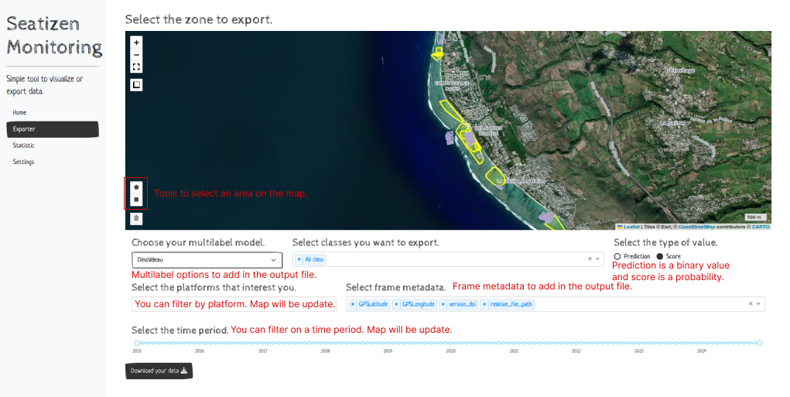

# Tutorial to use zenodo-tools

* Installation
* Launch and use SeatizenMonitoring

* Download a session
    a single session from a doi
    a 

* Upload a session
    - Raw data session
    - Processed data session
    - Update metadata
    - Delete all 

* Construct geopackage


# Installation

To use this github repository, you have two options. You can either use docker or install the libraries and packages manually with a conda environment.

## Docker

To use our docker image, you need to install [Docker](https://www.docker.com/).

We have 2 docker image

* **zenodo-manager** is docker image to provide an interactive shell to use all python script in the good environnement.

To use the interactive shell of zenodo-manager, you need to execute this command to launch the container :
```bash
docker run -it --user 1000 --rm \
  -v ./seatizen_atlas_folder/:/home/seatizen/app/seatizen_atlas_folder \
  -v ./plancha_test:/home/seatizen/plancha \
  -v ./inputs:/home/seatizen/app/csv_inputs \
 --name zenodo-manager seatizendoi/zenodo-manager:latest bash
```

Parameters :
- `-it` is to launch the shell in interactive mode 
- `--user 1000` is to grant user access 
- `--rm` is to removed the container after it finished
- `-v` is to mount a volume to share data between your machine and the container


* **zenodo-monitoring** is docker image to launh zenodo-monitoring script.

To use zenodo-monitoring, you need to execute this command :
```bash
docker run --rm -d --name zenodo-monitoring -p 8050:8050 seatizendoi/zenodo-monitoring:latest
```

Parameters :
- `--rm` is to removed the container after it finished
- `-d` is to detach the container to keep the terminal
- `-p 8050:8050` is to specify the port
- `--name` named the container


## Local installation

To ensure a consistent environment for all users, this project uses a Conda environment defined in a `zenodo_env.yml` file. Follow these steps to set up your environment:

1. **Install Conda:** If you do not have Conda installed, download and install [Miniconda](https://docs.conda.io/en/latest/miniconda.html) or [Anaconda](https://www.anaconda.com/products/distribution).

2. **Create the Conda Environment:** Navigate to the root of the project directory and run the following command to create a new environment from the `zenodo_env.yml` file:
```bash
conda env create -f zenodo_env.yml
```

3. **Activate the Environment:** Once the environment is created, activate it using:
```bash
conda activate zenodo_env
```

4. **Other lib:** Install mod-spatialite. Here for ubuntu 22.04
```bash
sudo apt-get install sqlite3 libsqlite3-mod-spatialite
```

Optional. **Create config.json:** To use this repository, you need a config.json file at the root of the project containing your own ACCESS_TOKEN:
```json
{
    "ACCESS_TOKEN": "ACCESS_TOKEN",
    "ZENODO_LINK": "https://zenodo.org/api/deposit/depositions"
}
```
# Examples

* [How to use Seatizen-monitoring](#how-to-use-seatizen-monitoring)
* [Create a custom class](#create-a-custom-part)

## Seatizen monitoring

### How to use Seatizen-monitoring



### Create a custom part


## Zenodo download

*Zenodo donwload provides tools to easily download data.*

### Arguments

Mutual exclusive arguments:
* `-edoi`, `--enable_doi`: Take a doi.
* `-ename`, `--enable_name`: Work from a session name.
* `-ecsv`, `--enable_csv`: Work from csv.
* `-ecf`, `--enable_custom_frames`: Work from csv to get specific frames.

Path for previous arguments:
* `-pcsv`, `--path_csv_file`: Path to the csv file, header can be session_name or doi or both.
* `-pcf`, `--path_custom_frames_csv`: Work with a csv file with FileName and version_doi inside to get specific frames.

Output path:
* `-po``--path_folder_out`: Output folder to rebuild sessions.

Data type to download. Raw data type need config.json with an zenodo api token.
* `-dr`, `--download_rawdata`: Download raw data from a session.
* `-dp`, `--download_processed_data`: Download processed data from a session.
 
Optionnal parameters:
* `-is`, `--index_start`: Choose from which index to start.
* `-ip`, `--index_position`: if != -1, take only session at selected index.


### Download selected frames on seatizen-monitoring

```bash
python zenodo-download.py -ecf -pcf /path/to/csv/file/provide/by/seatizen/monitoring -po /path/where/you/want/your/frames/folder
```

### Download raw data from a doi

You can provide generic DOI or version DOI. He will find all version with raw data.

```bash
python zenodo-download.py -edoi 11143166 -po /path/where/you/want/your/session/folder -dr
```

### Download processed data from a session name

If you provide a name to download, he will download the last version. If you want a specific version, you need to provide the corresponding DOI.

```bash
python zenodo-download.py -ename 20221023_SYC-ALDABRA-DUBOIS_ASV-02_02 -dp -po /path/where/you/want/your/frames/folder
```


### Download session data from csv file


